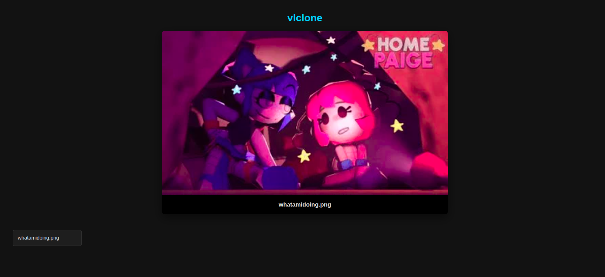

# vlclone
Somewhat working self-hosted streaming service using Node.js

This is considered as a coding practice.


# Running
## Dependencies
- Node.js (v24.15)
- NPM (v11.12.1)
- Express
- nodemon
- 
To install them, simply type `npm install`.

If you're running ***__vlclone__*** on your PC and want to access your files on mobile or other hardwares, type `ipconfig` to your CMD (Windows) and SPECIFICALLY find your Wi-Fi's/LAN's IPV4 address, then copy and paste that to your other hardware's url tab.
However, if you're on Linux (like me as of writing this), type `hostname -I` on the Terminal.
BUT, HOWEVER, if you're on MacOS, type `ipconfig getifaddr en0` (if using Wi-Fi) or `ipconfig getifaddr en0` (if using LAN) on the Terminal.

## Adding medias
Simply put your medias onto the media folder.
Supported medias (as of 04/18/2026:):
- .mp4
- .webm
- .ogg
- .ogv
- .mp3
- .png
- .jpg
- .jpeg
- .gif
- .webp
- 
## Compiling
Here's the fun part. You dont use `node`. Instead, you use `npm run stream`.
It's a pre-added script on package.json to make it easy to compile.

## Seeing the media
Simply go to localhost:3000. You can also change the port in `server.js` at line 5:

```javascript
const PORT = 3000; // <- change the port to anything you like (as long as its numbers)
```

If you're running ***__vlclone__*** on your PC and want to access your files on mobile or other hardwares, type `ipconfig` to your CMD (Windows) and SPECIFICALLY find your Wi-Fi's/LAN's IPV4 address, then copy and paste that to your other hardware's url tab.

However, if you're on Linux (like me as of writing this), type `hostname -I` on the Terminal and do the same thing as Windows.

BUT, HOWEVER, if you're on MacOS, type `ipconfig getifaddr en0` (if using Wi-Fi) or `ipconfig getifaddr en0` (if using LAN) on the Terminal and do the same thing on Windows.

# FAQS
***Q: Why use nodemon?***
***A: You should already know this. nodemon allows you to restart the server INSTANTLY after a change on the root of vlclone.***

***Q: Why node.js?***
***A: Simple. It's already a great library to make servers.*** 

# Getting a bug?
Report the issue [here.](https://github.com/rmcvxzz/vlclone/issues)
