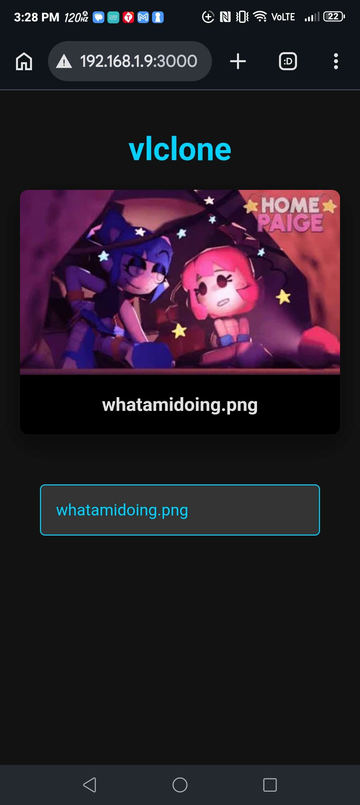

# vlclone
Somewhat working self-hosted streaming service using Node.js

This is considered as a coding practice.



(you can view more demos [here](./something))
# What are the features?
vlclone has evolved from a simple file lister into a smart media pipeline:

* **Smart Transcoding Engine (v1.4)**
    * Automatically detects heavy desktop formats (.mov, .mkv) and optimizes them into mobile-friendly H.264 MP4s in the background.
    * Uses Fast-Start (moov atom) optimization, allowing you to seek through huge 4K videos instantly without waiting for a full download.
* **Automatic Visual Previews**
    * Auto-generates high-quality thumbnails for every video in your library using FFmpeg.
    * Smart "Processing" badges in the UI so you know exactly when a video is being optimized.
* **Production-Grade Stability**
    * **Concurrency Guard:** A built-in traffic controller that prevents FFmpeg from eating 100% of your CPU by processing only one video at a time.
    * **Rate Limiting:** Protects your server from being spammed by too many rapid requests.
    * **Helmet.js Integration:** Hardens your streaming headers against common web vulnerabilities.
* **Real-Time Sync and Search**
    * **8-Second Heartbeat:** The library automatically syncs with your /media folder every 8 seconds—no manual refresh needed.
    * **Instant Search:** Filter through hundreds of files in real-time as you type.
    * **Activity Log:** A built-in terminal-style logger in the UI to track new files, deletions, and processing status.
* **Performance Optimized**
    * **Gzip Compression:** All metadata and API responses are compressed to save mobile data.
    * **Byte-Range Streaming:** Supports "Partial Content" (206) for smooth seeking and resuming on Android/iOS players.
    
# Running the software as a whole
## Dependencies
- Node.js (v24.15)
- NPM (v11.12.1)
- Express
- nodemon
- FFmpeg
- Helmet.js
- 
To install them, simply type `npm install`.

## REMEMBER, YOUR DEVICES MUST CONNECT INTO THE SAME WI-FI TO ACCESS THE FILES!!!
If you're running ***__vlclone__*** on your PC and want to access your files on mobile or other hardwares, type `ipconfig` to your CMD (Windows) and SPECIFICALLY find your Wi-Fi's/LAN's IPV4 address, then copy and paste that to your other hardware's url tab.
However, if you're on Linux (like me as of writing this), type `hostname -I` on the Terminal.
BUT, HOWEVER, if you're on MacOS, type `ipconfig getifaddr en0` (if using Wi-Fi) or `ipconfig getifaddr en0` (if using LAN) on the Terminal.

Do note; vlclone works better on wifi.

## Adding medias
Simply put your medias onto the media folder.
Supported medias (as of 04/18/2026:):
- .mp4
- .webm
- .ogg
- .ogv
- .mp3
- .png
- .jpg
- .jpeg
- .gif
- .webp
## Compiling
Here's the fun part. You dont use `node`. Instead, you use `npm run stream`.
It's a pre-added script on package.json to make it easy to compile.

## Seeing the media
Simply go to localhost:3000. You can also change the port in `server.js` at line 9:

```javascript
const PORT = 3000; // <- change the port to anything you like (as long as its numbers)
```

# FAQS
***Q: Why use nodemon?***
***A: Because it's simply great. As a developer, nodemon is the first package i install on every node.js project i have. Read [about it here.](https://nodemon.io/)***

***Q: Why node.js?***
***A: Simple. It's already a great library to make servers.*** 

***Q: Where did the name come from?***
***A: vlclone is VLC + Clone + full lowercase. vlclone was originally made to be a generic VLC clone using node.js.***
# Getting a bug?
Report the issue [here.](https://github.com/rmcvxzz/vlclone/issues)
